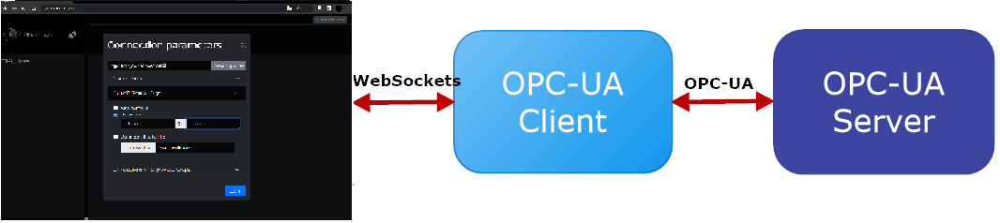

# OPC UA Browser

This OPC UA browsing tool, designed for the [Mako server](https://makoserver.net/),  includes an HTML based OPC UA browser user interface and a server-side OPC UA client. The OPC UA browser user interface is implemented as an HTML, and JavaScript powered Single Page Application (SPA). The SPA runs in the browser and communicates with the server-side OPC UA client using WebSockets.



The HTML user interface offers a straightforward way to connect to any OPC UA server using an OPC UA client located on the server. As an added convenience, an OPC UA server automatically starts on the same machine as the OPC UA client, eliminating the need to run multiple Mako servers independently.
Once the server is operational, it can be accessed by typing the endpoint URL 'opc.tcp://localhost:4841' into your web browser. The term 'localhost' in the URL is used because the example server runs on the same machine as the OPC UA client webpage. This setup allows you to quickly test the OPC UA client without the need to launch a separate third-party OPC UA server.

The client's default OPC UA endpoint address is to the local OPC UA
server. You can use any OPC UA server address, such as the 
public OPC UA server: opc.tcp://opcuaserver.com:48010. You can also
connect external OPC UA clients to the embedded OPC UA server. See
the [OPC UA Client to Server Tutorial](https://realtimelogic.com/ba/opcua/thirdparty_clients.html)
in the OPC UA main documentation for how to connect various OPC UA
clients.

## Running the OPC UA browsing tool:

To run this tool, you must use the Mako Server as the [OPC UA foundation](https://realtimelogic.com/ba/opcua/index.html). Begin by downloading and installing the Mako Server specific to your platform. You can find the download and installation instructions [here](https://makoserver.net/download/overview/)


Next, download the [latest OPC UA release](https://github.com/RealTimeLogic/OPC-UA-Browser/releases). Once downloaded, place the archive in the same folder as the Mako Server executable.

To run the application, follow these steps:

1. In the Command Prompt window, use the "cd" command followed by the directory path to change to the directory where the Mako Server executable is located.

   ```
      cd c:\mako
   ```

2. To start the OPC UA client application.

   Start the tool with default settings as follows:
   ```
      >mako -l::opcua-browser.zip

      Mako Server. Version 3.9
      BAS lib 5453. Build date: Jun  6 2023
      Copyright (c) Real Time Logic.

      Mounting /D/mako/mako.zip
      Server listening on IPv6 port 80
      Server listening on IPv4 port 80
      Loading certificate MakoServer
      SharkSSL server listening on IPv6 port 443
      SharkSSL server listening on IPv4 port 443
      1: Initializing OPCUA
      Loading opcua-browser.zip as "root application" : ok
   ```

3. To access the OPC UA Web Client, open a web browser and enter the following URL: http://localhost:portno

   Replace "portno" with the appropriate port number that the Mako
   Server is listening on. By default, the Mako Server listens on
   port 80 for HTTP connections or port 9357 if it cannot open port 80.

4. In the modal that appears, enter the URL of the OPC UA endpoint
   and provide the necessary authentication parameters. If you're
   conducting testing, you can use the default address for the
   OPC UA server, which is 'opc.tcp://localhost:4841'. As previosly mentioned, the OPC UA client also includes an OPC UA server bundled in the same archive. If you have your own OPC UA server, you will need to
enter its specific URL.

   Default user name for username authentication:
   - username: 'admin'
   - password: 'admin'

Set the credentials if you are connecting to your own OPC UA server. You may also authenticate using an X509 certificate if your OPC UA server requires certificate authentication.

5. Click on login button.

6. Once the connection is established, you will be presented with a root node. To explore its contents, click the plus (+) symbol in the browser to expand the root node. In the right panel, you will find the OPC UA attributes and their corresponding values, providing detailed information about the node.

Check out the following slideshow, which demonstrates the step-by-step process of connecting to an OPC UA server and browsing its nodes:


## Configuration file

The OPC UA client application utilizes a logging configuration and
retrieves user information from a Mako configuration file. The following example shows a configuration file:

```
tracelogger = {
    priority = 1 -- Filters out lower priority messages
}

users = {
    user = "password",
    admin = "12345"
}
```

By default, the Mako server reads the configuration file 'mako.conf'. If you want to use a specific configuration file, you can use the following command line:

```
>mako -c mako.conf -l::opcua-browser.zip
```

For more information on the configuration file, please refer to the [Mako server's configuration file](https://realtimelogic.com/ba/doc/?url=Mako.html#cfgfile)


## Building the OPC UA Browser from sources:

The OPC UA browser must be assembled using the following:
- [NodeJS](https://nodejs.org/) (min version 16.16.0)
- [Vue.js](https://vuejs.org/)
- [Pinia](https://pinia.vuejs.org/)

Install Node.JS, the additional tools are installed using the first command below:

```
npm install
npm run create-zip
```

The second command should produce `opcua-browser.zip`

# Additional commands you may find helpful.

- **build** build with lint check
- **build-only** run build only without any lint, all files copy to folder dist
- **dist** create mako application zip archive from `dist' directory.
- **create-zip** run build only without any lint and create mako application (zip archive) from `dist' directory.
- **dev**   run development server
- **test**  run all tests
