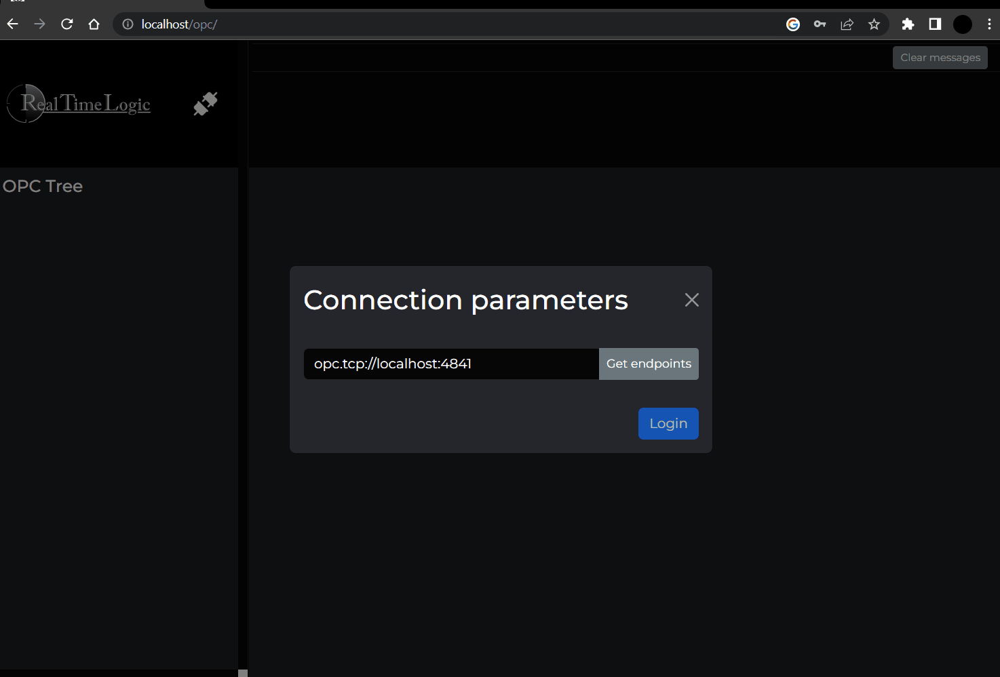

# OPC-UA Client and Web Client

This example includes an OPC-UA browser user interface and a server
side OPC-UA client. The OPC-UA browser user interface is implemented
as an HTML and JavaScript powered Single Page Application (SPA). The
SPA runs in the browser and communicates with the server side OPC-UA
client using WebSockets.


The HTML user interface provides a simple and convenient way to
connect to any OPC UA server using an OPC-UA client on the server
side. In this case, a server is automatically started on the same
machine as the website, so you don't need to start the server
separately. Once the server is up and running, you can access it
by entering the endpoint URL 'opc.tcp://localhost:4841' into your
browser. The use of 'localhost' in the endpoint URL is because the
example server is running on the same machine as the OPC UA client
web page. This example server allows you to quickly test the OPC UA
client without needing to start a third-party OPC UA server.

The client's default OPC-UA endpoint address is to the local OPC-UA
server. You can use any OPC-UA server address, such as the following
public OPC-UA server: opc.tcp://opcuaserver.com:48010. You can also
connect other (external) OPC-UA clients to the server example. See
the [OPC-UA Client to Server Tutorial](https://realtimelogic.com/ba/opcua/thirdparty_clients.html)
in the OPC-UA main documentation for how to connect various OPC-UA
clients.

## Running OPCUA Client:

To run the application, you need to use the Mako Server as the OPCUA client. Begin by downloading and installing the Mako Server specific to your platform. You can find the download and installation instructions [here](https://makoserver.net/download/overview/)


Next, you'll need to download an archive containing the OPCUA client application. You can find the archive [hereon](https://github.com/RealTimeLogic/opcua-client/releases). Once downloaded, place the archive in the same folder as the Mako Server executable.

To run the application, follow these steps:

1. In the Command Prompt window, use the "cd" command followed by the directory path to change to the directory where the Mako Server executable is located.

   ```
      cd c:\mako
   ```

2. To start the OPCUA client application.

   Most simple is to run application with default settings.
   ```
      >mako -l::opcua-client.zip

      Mako Server. Version 3.9
      BAS lib 5449. Build date: May 18 2023
      Copyright (c) Real Time Logic.

      Mounting /D/mako/mako.zip
      Server listening on IPv6 port 80
      Server listening on IPv4 port 80
      Loading certificate MakoServer
      SharkSSL server listening on IPv6 port 443
      SharkSSL server listening on IPv4 port 443
      1: Initializing OPCUA
      Loading opcua-client.zip as "root application" : ok
   ```

3. To access the Mako Server, open a web browser and enter the following URL: http://localhost:portno

   Replace "portno" with the appropriate port number that the Mako
   Server is listening on. By default, the Mako Server listens on
   port 80 for HTTP connections. However, on Linux, the default
   port is 9357.

4. In the modal that appears, enter the URL of the OPCUA endpoint
   and provide the necessary authentication parameters. If you're
   conducting testing, you can use the default address for the
   OPCUA server, which is 'opc.tcp://localhost:4841'. It's important
   to note that the OPCUA client also runs an OPCUA server on the
   same host. If you have your own OPCUA server, you will need to
   enter its specific URL.

   Default user name for Username authentication:
   - username: 'admin'
   - password: 'admin'

   To authenticate with certificate it is required any X509 certificate.

   Authentication an your own OPCUA server authentication most probably require different
   username/password and specific certificate parameteres.

5. Click on login button.

6. Once the connection is successfully established, you will be presented with a root node. To explore its contents, simply click the plus (+) symbol in the browser, which will expand the root node. On the right panel, you will find the OPCUA attributes along with their corresponding values, providing you with detailed information about the node.

Please take a look at the following slideshow, which demonstrates the step-by-step process of connecting to an OPC-UA server and browsing its nodes:




## Configuration file

The OPCUA client application utilizes a logging configuration and
retrieves user information from a Mako configuration file. Here is
an example of the configuration file:

```
tracelogger = {
    priority = 1 -- Filters out lower priority messages
}

users = {
    user = "password",
    admin = "12345"
}
```

By default, Mako reads the configuration file named 'mako.conf'. If you want to
use a specific configuration file, you can use the following command line:

```
>mako -c mako.conf -l::opcua-client.zip
```

For more information on the configuration file, please refer to the Mako [documentation](https://realtimelogic.com/ba/doc/en/Mako.html#TraceLogger)


## Building OPCUA from sources:

OPCUA client created with the following tools:
- NodeJS min version 16.16.0
- VueJS
- Pinia
- Cypress e2e testing framework

To build mako application you need to run following commangs:

```
npm run install -D
npm run build-only
npm run dist
```

This sequence ofommands will produce zip archive `opcua-client.zip`

# Usefull targets specified the package json.

- **build** build with lint check
- **build-only** run build only without any lint, all files copy to folder dist
- **dist** create mako application zip archive from `dist' directory.
- **dev**   run development server
- **test**  run all tests
